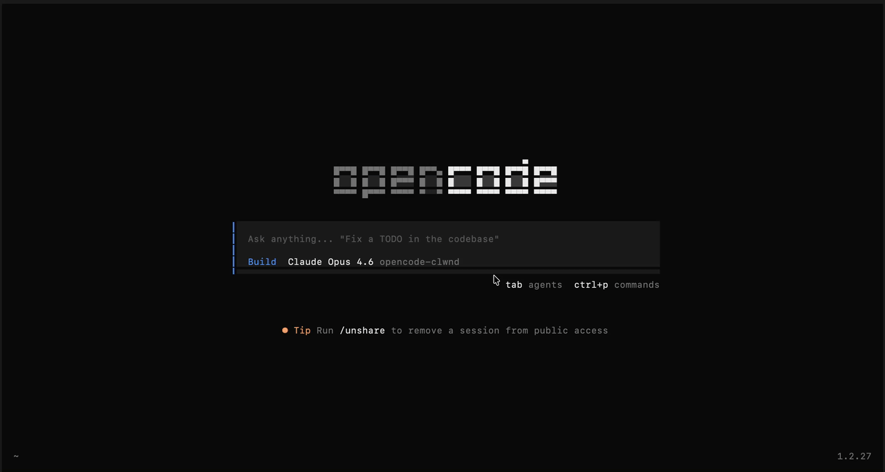

<p align="center">
  <strong>\_ hum _/</strong>
  <br>
  A sentinel for your multiplexed cross-harness AI bots.
  <br>
  <strong>Supported today:</strong> + OpenCode session governance + Claude Code providers in headless (compliant) mode  
  <br><br>
  
</p>

```
curl -fsSL https://raw.githubusercontent.com/adiled/hum/main/install | bash
```

hum ([/klwʊnd/](https://ipa-reader.com/?text=%2Fklw%CA%8And%2F)).

```
hum update
hum status
hum logs
hum sessions
hum uninstall
```

Needs git, node (v20+), pnpm, opencode, claude.

Core workflow is operational (more coming). See [compatibility](https://github.com/adiled/hum/issues/8).

**Config** `~/.config/hum/hum.json`

| Key | Default | Description |
|---|---|---|
| `maxProcs` | `4` | Max concurrent Claude CLI processes |
| `idleTimeout` | `30000` | Kill idle process after ms (0 = disabled) |
| `smallModel` | `""` | Override small model (empty = auto-discover free model) |
| `permissionDusk` | `60000` | Permission prompt timeout in ms before auto-deny |
| `droned` | `false` | Enable the drone — stream observer, context-loss detection, auto-recovery |
| `droneModel` | `opencode-hum/claude-haiku-4-5` | Model for drone LLM assessments |

**External MCP**

MCP servers configured in `opencode.json` are available to Claude. hum's daemon spawns and proxies local MCP servers (e.g. context7). Auth-bound (OAuth) MCPs are not yet supported.

hum denies file writes in directories parent to `cwd`. Until ask is supported for that, you can use [`opencode-dir`](https://github.com/adiled/opencode-dir) plugin's `/cd` and `/mv` commands to relocate your session to the desired directory.

**Tips**

hum currently relies on opencode as _the harness_ because of thorough customizability. Utilize its configuration to the fullest.

- hum sanitizes prompts to ensure undisrupted usage, ensure any custom prompts do not depend on xml tags and second-person attributions
- hum greatly strips away commonly expected file system tools by any harness, with more superior code and non-code tooling, but does not dictate prompt engineering or reminders around them yet, so take control of that as needed
- hum code analysis and authoring tools `read` `do_code` are pure AST-based and are limited to few languages, non-code writing tool `do_nocode` can be relied on for yet unsupported languages
