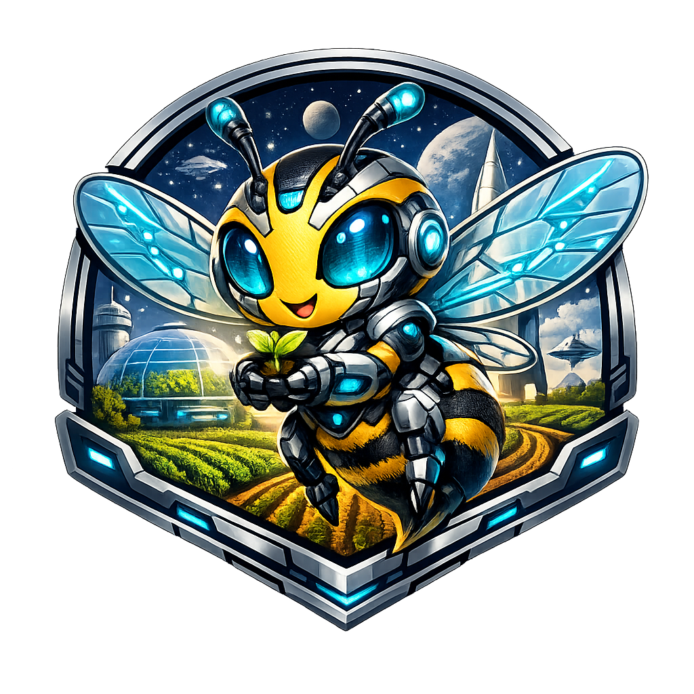

<p align="center">
  
  <br>
  <strong>﹏ hum ﹏</strong>
  <br>
  The only AI stack nestled on a biodiverse agentic kernel framework.
</p>


```
curl -fsSL https://raw.githubusercontent.com/adiled/hum/main/install | bash
```

**hum** (n.) The phenomena occuring upon perfect harmonization of all players in an AI composition.

**Key buildings blocks**

it is all composed of biodiverse primitives, not an outcome of conventional linguistics, following are some nouns

- **hive** the kind, a typology a bee conforms to
- **bee** the instance, a running participant a hive commissions
- **nestler** a bee mid-handshake, awaiting the breath that accepts its hello
- **nestled** a nestler once registered into the nest
- **nest** where nestled bees gather, inside humd
- **thrum** the hum-native vibration protocol, carrying tones across a range of `chi`
- **petal** one unit of content, be it text, image, a tool call or its result
- **bloom** one turn of conversation, opened by a prompt and closed when it wilts
- **ensemble** the mesh of cooperating humds, where inference, compute, filesystem, dependencies and UX decouple and gossip back into the hum

**Ensemble: Bee Gossip**

An ensemble is a mesh of cooperating humds, where bees gossip like a hive trading news of distant blossoms. A single bloom never lives on one box. It draws inference from one humd, compute from another, a filesystem from a third, and surfaces in a UX somewhere else again. No bee is bound to its own field; it forages for miles, following the scent of the universe for any model, tool, payment rail, or dataset no flower nearby could give. No monolith, no central broker, each capability sovereign on the host that grew it.

This is the whole of it, a decoupling so complete that the scattered many become one again, a single hum carrying across the long dark between distant stars. You raise a capability wherever it belongs, let it gossip, and the swarm folds it into the hum. Nothing needs repointing, nothing needs redeploying. Every new bee only deepens the hum.

Learn more by simply humming along.. or read the [scenarios](https://adiled.github.io/hum/scenarios/), one story per ensemble narrative.

**Config** `~/.config/hum/hum.json`

Refer to hum.schema.json

**Comparison for the sake of comparison**

> hum is an agentic kernel, not an LLM router, and incomparable in scope. This table simply highlights
> how hum's out-of-the-box hives overlap with the winning representative from each class.

| Capability | hum | LiteLLM | Ollama | LocalAI | CAMEL | Azure Agent Framework | Phoenix | vLLM | Open WebUI |
|---|---|---|---|---|---|---|---|---|---|
| **Class** | Agentic kernel | Router / proxy | Local model server | Multi-modal AI server | Multi-agent framework | Multi-agent orchestrator | AI observability & evals | Production inference serving | LLM web UI |
| **Language** | Rust | Python | Go | Go | Python | Python / .NET | Python | Python | Python |
| **Model gateway** | ✅ (hives gossip) | ✅ 100+ APIs | ✅ Local models | ❌ | ❌ | ❌ | ❌ | ❌ | ❌ |
| **OpenAI-compatible API** | ✅ (`openai-server` hive) | ✅ | ✅ | ✅ | ❌ | ❌ | ❌ | ✅ | ✅ |
| **Ollama-compatible API** | ⚠️ (in progress, see [issue #44](https://github.com/adiled/hum/issues/44)) | ❌ | ✅ | ❌ | ❌ | ❌ | ❌ | ❌ | ✅ |
| **Multimodal: vision, TTS, STT, image gen** | ❌ (honeybee or external hive) | ❌ | ❌ | ✅ LLM, vision, voice, image, video | ❌ | ❌ | ❌ | ❌ | ✅ |
| **Built-in TUI** | ✅ (decoupled, wryme in progress) | ❌ | ❌ | ❌ | ❌ | ❌ | ❌ | ❌ | ✅ |
| **Self-hosted, local-first** | ✅ (kernel runs anywhere) | ✅ | ✅ | ✅ | ❌ (cloud) | ✅ | ✅ | ✅ | ✅ |
| **Multi-agent orchestration** | ✅ (bee/nest primitives) | ❌ | ❌ | ❌ | ✅ agents + roles | ✅ workflows + agents | ❌ | ❌ | ❌ |
| **Agent memory / long-term context** | ✅ (`bloom` + `thrum` protocol) | ❌ | ❌ | ❌ | ✅ (societal memory) | ✅ (cognitive memory) | ❌ | ❌ | ❌ |
| **Streaming / SSE** | ✅ (thrum tones, `petal` primitives) | ✅ | ✅ | ✅ | ✅ | ✅ | ❌ | ✅ | ✅ |
| **Agent tracing / observability** | ✅ (`humd` runtime, `thrum` transport) | ✅ (cost, usage, logs) | ❌ | ❌ | ✅ (swarm traces) | ✅ (run traces, deploy) | ✅ traces, evals, prompt mgmt | ❌ | ❌ |
| **Tool / MCP gateway** | ✅ (MCP serde + hive) | ✅ | ✅ | ✅ | ✅ | ✅ | ✅ | ❌ | ✅ |
| **RAG / retrieval pipeline** | ❌ (external hive) | ✅ (via adapters) | ✅ | ✅ | ❌ | ✅ (Azure AI) | ✅ vector DBs | ❌ | ✅ |
| **Guardrails / safety** | ❌ (bee responsibility) | ✅ | ❌ | ❌ | ❌ | ✅ | ✅ | ❌ | ❌ |

**Bottom line:** routers proxy; hum composes. Each hum hive is a sovereign capability, inference, tool use, payment, UX, that gossips into the ensemble. An LLM gateway routes requests; hum routes *biodiverse primitives* into a harmonized flow.
